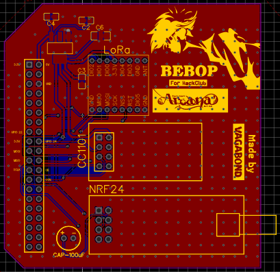
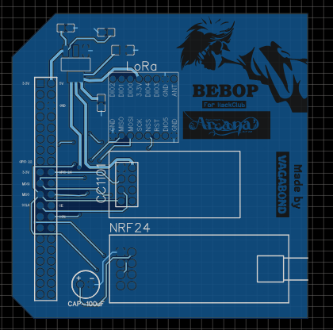
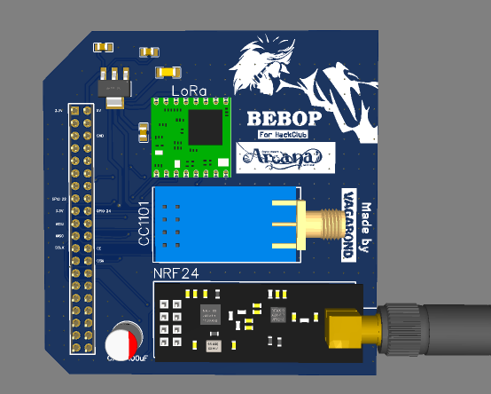

# BEBOP: A Carrier Board Inspired by Cowboy Bebop

 

## Total Project Time = 27
### Total Journal Hours = 10
### Total Lapse Hours = 17

*Note: All the Hours in this Journal are not double Counted, all the time was spent researching and fixing problems etc. and were not recorded by Lapse. the designing time was indeed recorded by Lapse.*

## 3-July-2026, (Hours = 2)

### The First Step: The Components

### These are the Components I'm Going to Use:

- **Raspberry Pi 5**
- **NRF24L01**
- **AMS1117 Power Regulator**
- **Multiple Capacitors** 
- **CC1101** 
- **LoRa RFM95W**

These modules will be on the Carrier board I'll design. Why these Modules? you may ask, well these modules are highly used in the field of Cybersecurity and Networking. All of these modules can read radio waves and also transmit waves. and the the best of these is the LoRa RFM95W, which can send signal for up to 2KM's. this way you can talk to your friends etc from a long distance without internet, this is really useful and situations where you don't have internet connection. There are already alot of communties which are using these modules to avoid paying the corpo. checkout mesh network, or meshtastic on reddit. Its truly Facinating how much technology has evovled. 

## 4-July-2026, (Hours: 2)

*"Note: time isn't double counted, these 3 hours were spent researching about the pinouts of every component and how each component works with each other."*

### Carrier Board:

Now it was time to work on the Carrier board which will fit onto the 40 GPIO pins of the header and will have the All the Modules Wired. I had to Learn how the schematics, PCB design etc works and started making the Carrier Board.

My First SCHEMATIC:

it only includes 2 modules which are NRF24L01 and CC1101 because I hadn't come across LoRa at this time. This Schematic contains the Pi Header 2x20, a capacitor for the NRF module because it has sudden urges of sipping more power than required.

and this is the PCB Design:

*Note: this Design had alot of flaws, more on that later.*

Thats All I did on today, see you the next day.

## 5-July-2026 (Hours: 2)

*"Note: These Hours are not Double Counted, this time was spent Researching about the Problems I was facing and the solutions, Researching about the New Module (LoRa), pinout for LoRa and how it connects to the Pi."*

### Design Flaw and Addition of New Module:

I had finished the Schematic and the PCB yesterday so I thought I'd post it on the discord server so an expert can see it and give advice on what's wrong and what could be better. I left that message and went to work on the CAD, I wanted to check how everything would look when assembled, so I grabbed the CAD (GrabCAD hehe) of all the stuff like RPI5, NRF, CC1101 and LoRa module, I learned how to use onshape to assemble stuff. After learning I used the Fastened Mate button to assemble everything. Now there was a problem.

The antenna wouldn't Fit, the pins of the modules were just barely missing the Pi. and the frequencies would mess because the NRF module is right above the CPU. I Planned the Redesign and started working on it. it took alot of time and this is how it looked:

I was very Happy with this design. In this design I changed the position of the Female Header to the Far Left and all the Module on the right side facing right. This way the Radio won't be in the way of the Pi and it connects beautifully. Then I got a notification from the Discord server. lets talk about that on the next day.

## 6-July-2026 (Hours: 2)

*"Note: These Hours are not Double Counted, it was spent Researching for the Power Regulator I added and the mistakes I encountered."*

### The Discord Guy's Advice:

This happend yesterday but you need a little suspense in life man cmon. Ok so the Guy reviewed my Previous Design, the one that had alot of Flaws, and he did point out those flaws. But I had fixed those already so I sent the New Design and He gave good advice. He said that I should put a power regulator like AMS1117 which connects to the 5V pin on the Pi and then converts it into 3.3V for the modules. He suggested this because all the modules I have used sip alot of power and the 3.3V cannot give that much power, and if it can't then what happens is a Brownout (Pi reboots). So to fix that I used the AMS1117. He also said to move the capacitor as close as possible to the Module otherwise the capacitor won't be helpful. He also said to make the tracks 45 degrees but it would take alot of time so i didn't fix it. After all of those fixes here's how it looks:

SCHEMATIC:

CAD:

I think Thats the Final Iteration of the Carrier Board. 

**spoiler: it wasn't**

## 7-July-2026 to 8-July-2026 (Hours: 2)

*"Note: These Hours are not Double Counted."*

I added more stuff to the Carrier board like Bypass Capacitors etc to the Power Regulator, which would prevent the Raspberry pi to reboot on high load. it was hard to do cuz i barely had any space. But I managed to fit all of it and route everything. Another Major fix was fixing the 90 degrees Routing, which i heard is bad, so I fixed it. I also added alot of stuff on the silkscreen like images and text. Here's the final look:

and in 3D:

I'm super happy with how it turned out considering its my first PCB. Well That's all for this Project. 
           
////...***See you Space Cowboy.***