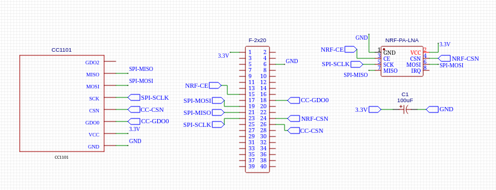
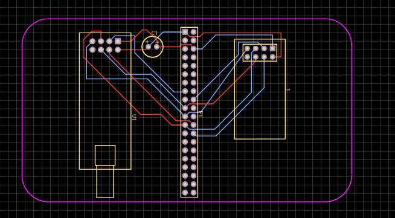
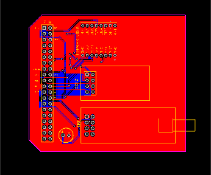
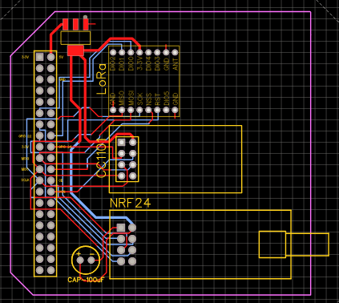
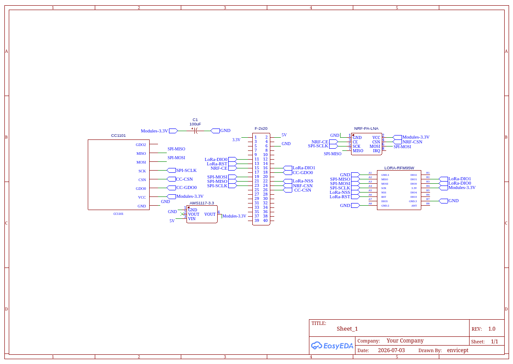
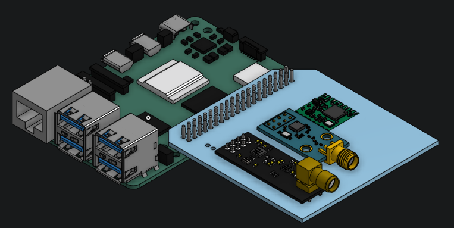
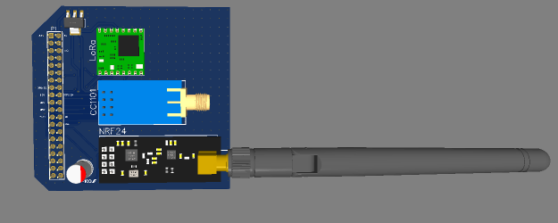

# BEBOP: A Cyberdeck Inspired by Cowboy Bebop

 

## 1-July-2026 to 3-July-2026, (Hours = 10)

### The First Step: The Components

If you want to build your own Cyberdeck then You have to find components. The main Components includes  

- **SBC**, which is going to be the Brain of the build (Raspberry Pi's etc) 

- **Display** (Optional, it can be a normal Display or Vr glasses etc) 

- **Battery** to power the cyberdeck

- **Inputs** (Keyboard, Trackpad or Trackball etc)

- **Case** (You can use a cool box or 3D Print one yourself)

It's the Most Important part of building a cyberdeck and the most time consuming. You also have to know which Part is better etc and which you should Avoid, and for someone starting new it's pretty hard to find right communities. Here are some communities you should joine in order to get a better grasp at what is a Cyberdeck and What's the Process of making it.

- [The Cyberdeck Cafe](https://cyberdeck.cafe/)

- [r/cyberdeck](https://www.reddit.com/r/cyberdeck)

### These are the Components I'm Going to Use:

- Raspberry PI 5
- Waveshare UPS HAT for Powering the Pi
- Waveshare 7' DSI IPS Display
- Keychrone Keyboard 60% (not sure about this since I also need a trackpad, or i can add a trackball??) 
- Some Extra modules like **NRF24L01**, **CC1101** and the beast **LoRa RFM95W** which will be on the separate Carrier board I'll design.

- and my own 3D printed Case to put all the stuff in

Finding the Components took alot of time because you have find stuff which is best and compatible to your Main SBC, which in my case is the RPI5. These days were also spent learning the software and tools like EasyEDA, Onshape. and the How the Schematics etc all means. Since it's my first time working with hardware. 

Thats all for today.

## 4-July-2026, (Hours: 3)

*Note: time isn't double counted, these 2 hours were spent researching about the pinouts of every component and how each component works with each other.*

### Carrier Board:

Now it was time to work on the Carrier board which will fit onto the 40 GPIO pins of the header and will have the All the Modules Wired. I had to Learn how the schematics, PCB design etc works and started making the Carrier Board.

My First SCHEMATIC:

it only includes 2 modules which are NRF24L01 and CC1101 because I hadn't come across LoRa at this time. This Schematic contains the Pi Header 2x20, a capacitor for the NRF module because it has sudden urges of sipping more power than required.

and this is the PCB Design:

*Note: this Design had alot of flaws, more on that later.*

Thats All I did on today, see you the next day.

## 5-July-2026 (Hours: 3)

*Note: These Hours are not Double Counted, this time was spent Researching about the Problems I was facing and the solutions, Researching about the New Module (LoRa), pinout for LoRa and how it connects to the Pi.*

### Design Flaw and Addition of New Module:

I had finished the Schematic and the PCB yesterday so I thought I'd post it on the discord server of cyberdeck cafe in order to get advice on what's wrong and what could be better. I left that message and went to work on the CAD, I wanted to check how everything would look when assembled, so I grabbed the CAD (GrabCAD hehe) of all the stuff like RPI5, NRF, CC1101 and LoRa module, I learned how to use onshape to assemble stuff. After learning I used the Fastened Mate button to assemble everything. Now there was a problem.

The antenna wouldn't Fit, the pins of the modules were just barely missing the Pi. and the frequencies would mess because the NRF module is right above the CPU. I Planned the Redesign and started working on it. it took alot of time and this is how it looked:

I was very Happy with this design. In this design I changed the position of the Female Header to the Far Left and all the Module on the right side facing right. This way the Radio won't be in the way of the Pi and it connects beautifully. Then I got a notification from the Discord server. lets talk about that on the next day.

## 6-July-2026 (Hours: 1)

*Note: These Hours are not Double Counted, it was spent Researching for the Power Regulator I added and the mistakes I encountered.*

### The Discord Guy's Advice:

This happend yesterday but you need a little suspense in life man cmon. Ok so the Guy reviewed my Previous Design, the one that had alot of Flaws, and he did point out those flaws. But I had fixed those already so I sent the New Design and He gave good advice. He said that I should put a power regulator like AMS1117 which connects to the 5V pin on the Pi and then converts it into 3.3V for the modules. He suggested this because all the modules I have used sip alot of power and the 3.3V cannot give that much power, and if it can't then what happens is a Brownout (Pi reboots). So to fix that I used the AMS1117. He also said to move the capacitor as close as possible to the Module otherwise the capacitor won't be helpful. He also said to make the tracks 45 degrees but it would take alot of time so i didn't fix it. After all of those fixes here's how it looks:

SCHEMATIC:

CAD:

I think Thats the Final Iteration of the Carrier Board. Now I have to build a Case to house all the components. Imma Do it Now.
